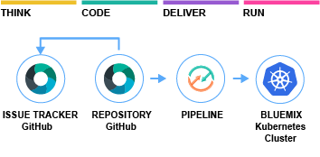

#  Metrics-Transformation-Service toolchain

### Continuously deliver a Docker app to a Kubernetes Cluster to transform SL messages
The Metrics Transformation application provides cloud services using Docker containers within a Kubernetes cluster. The DevOps toolchain called, `Metrics-Tranformation-Service`, depicted below comes preconfigured for continuous delivery, source control, issue tracking, and deployment of the IBM Bluemix Container service to a cluster of your choosing.

### Pre-requisites
1. An IBM Bluemix account. Log into [Bluemix Dashboard](https://console.bluemix.net/dashboard/apps/) to verify your account.
    - NOTE:  IBMers may use their IBM w3ID to log in using SAML.
1. A Kubernetes cluster. Use the [Bluemix Containers](https://console.bluemix.net/containers-kubernetes/home/clusters) UI to view your existing clusters. If necessary, click `Create Cluster` and follow prompts to create a new Kubernets cluster.

### To get started, click this button:

### Add Slack messaging (optional):
By default, the `Metrics-Tranformation-Service` toolchain does not come pre-configured with Slack message integration. Perform the following steps to add the Slack tool after creating the toolchain, to enable automated notifications sent to a Slack channel of your choosing.
1. Identify the Slack team name, and Slack channel, you wish your CI/CD pipeline to use.
1. Ensure an [Incoming Webhook](https://api.slack.com/incoming-webhooks) is integrated for the Slack channel you've choosen. Record the Slack Webhook URL, found in preferences for the webhook (sometimes referred to as an application).
1. Go to [Bluemix DevOps](https://console.bluemix.net/devops/toolchains) to view your existing toolchains.
1. Click the `Metrics-Transformation-Service` toolchain (created previously, via button above).
1. Click `Add a Tool`, and selct the `Slack` third-party tool.
1. Enter the Slack Webhook URL, Slack channel, and Slack team name values, recorded earlier.
1. Click `Create Integration`.

DONE. It's that easy! At this point, messages will be sent to your Slack channel each time your CI/CI delivery pipeline process is executed.

---
### Learn more 

* Blog [Continuously deliver your app to Kubernetes with Bluemix](tbd)
* Step by step [tutorial](https://www.ibm.com/devops/method/tutorials/tc_secure_kube)
* **First-time IBM Container Service users**: Make sure that your container image registry is correctly set up with a [namespace](https://console.bluemix.net/docs/services/Registry/index.html).
* [Getting started with Bluemix clusters](https://console.bluemix.net/docs/containers/container_index.html?pos=2)
* [Getting started with toolchains](https://bluemix.net/devops/getting-started)
* [Documentation](https://console.ng.bluemix.net/docs/services/ContinuousDelivery/index.html?pos=2)